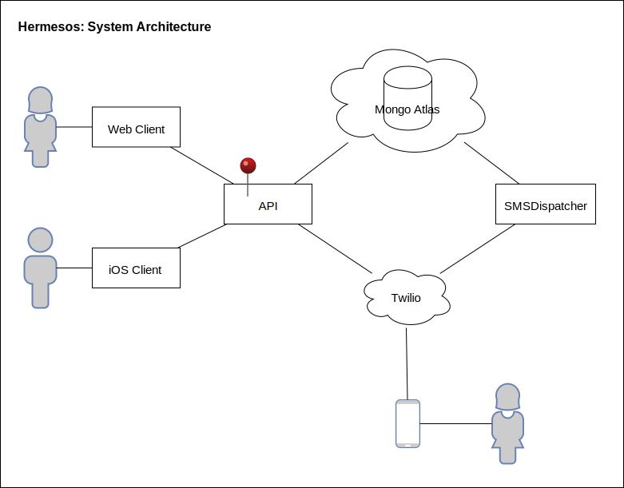
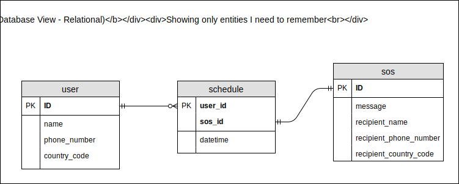

# HermeSOS

Schedule an SMS to your friend if you feel unsafe.

> * Hermes: Greek patron god of messengers
> * SOS: Morse code for *Help!*

## Dependencies

1. Node.js v10.4.1
2. npm v6.1.0

## Setup

	git clone <repo>
	cd <project>
	npm install
	npm run start

> Please note that this application relies on other services like a cloud-hosted Mongo DB cluster. So, you'll need to supply the appropriate environment variables in `example.env` and rename it to `.env`

## Dev Notes

### Deployment to Heroku

#### You need:

1. Heroku CLI
2. *heroku-config* plugin. Install with `heroku plugins:install heroku-config`

#### Steps:

1. Create a heroku app `heroku create <app-name>`
2. Add your envars to heroku `heroku config:push --file <env-file>`
3. Push your code to heroku `git push heroku master`

#### Helpful commands:
`heruku ps` - the state of your app
`heroku restart`
`heroku logs --tail`
`heroku run bash`

#### Gotchas:

* weird case-insensitive file naming issue with git on OSX
* config vars on heroku should be plain like `MY_VAR=my-value`, not quoted like `MY_VAR='my-value'`

## Project Documentation

### Architecture

Each subsystem is a separate repository and deployed separately.

### Entities

Since in reality we are using a document database, the actual entity structure uses the *one-to-squilion* pattern to establish the relationships.

